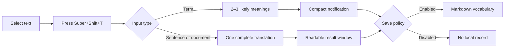
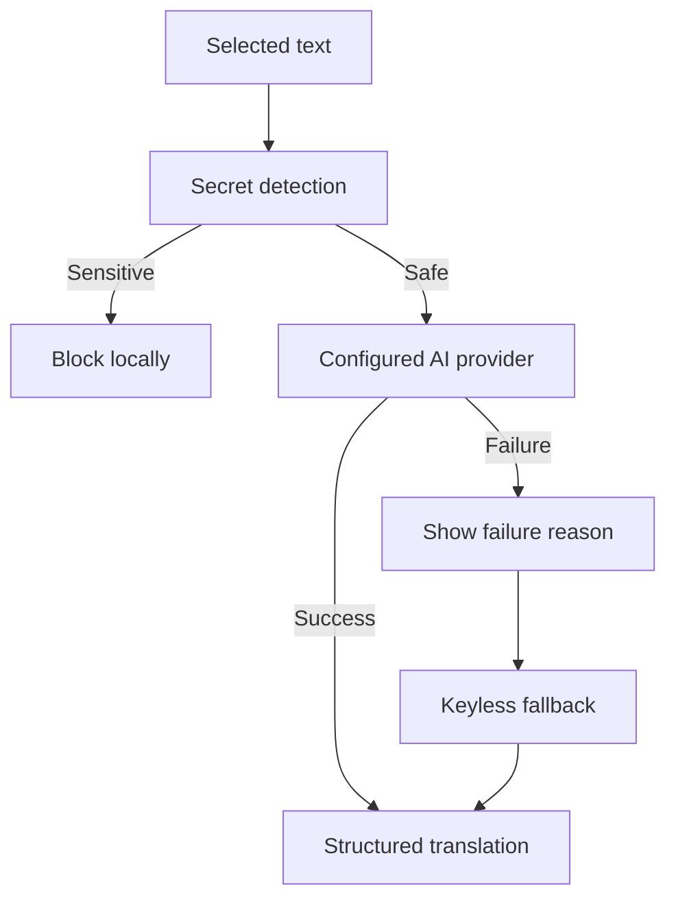

<div align="center">

# SDF Translator

**Translate selected text anywhere on your Linux desktop — fast, focused, and recall-friendly.**

[](https://github.com/GoKo-Son626/sdf/actions/workflows/ci.yml)
[](LICENSE)
[](#installation)
[](#platform-support)
[](pyproject.toml)

`sdf` in the terminal · `Super+Shift+T` on the desktop · Markdown vocabulary on your terms

</div>

SDF Translator is a lightweight, AI-assisted translation tool for Linux. Use it interactively in a terminal, or select text in a PDF reader, office suite, browser, Vim, or Neovim and translate it with one global shortcut.

It automatically detects the source language and translates into Simplified Chinese. Short terms return two or three likely meanings in a compact notification; sentences and documents return one complete, domain-aware translation in a focused result window.

## Why SDF?

| Experience | Behavior |
| --- | --- |
| **One shortcut** | Select text anywhere and press `Super+Shift+T`. |
| **Low-noise UI** | Terms use one compact notification; long text uses one readable window. |
| **Provider freedom** | DeepSeek, Gemini, Zhipu, Groq, OpenRouter, GitHub Models, SiliconFlow, or any OpenAI-compatible API. |
| **Graceful fallback** | A failed model request reports the reason, then falls back to keyless machine translation. |
| **Focused output** | Terms get 2–3 meanings; prose gets exactly one complete translation. |
| **Optional memory** | Save all results, terms only, prose only, or nothing to a clean Markdown file. |
| **Privacy guardrails** | Common secrets are blocked before network transmission; personal runtime files are excluded from Git. |

## How it works





## Platform support

- **Supported now:** Arch Linux on Wayland or X11, with automatic shortcut setup for niri and Xfce.
- **Installer support:** Arch Linux, Debian, and Ubuntu. Debian/Ubuntu support is newer and receives less CI coverage.
- The terminal application uses Python's standard library and follows the XDG directory layout.
- GNOME and KDE work with manual shortcut setup; automatic integration is planned.
- Fedora, CentOS Stream, and other package managers are planned.

| Component | Wayland | X11 |
| --- | --- | --- |
| Selection backend | `wl-clipboard` | `xclip`, with `xsel` fallback |
| Compact results | Freedesktop notifications | Freedesktop notifications |
| Long results | Zenity, Yad, or KDialog | Zenity, Yad, or KDialog |
| Automatic shortcut | niri | Xfce |

## Installation

### Arch Linux, Debian, or Ubuntu from Git

```bash
git clone https://github.com/GoKo-Son626/sdf.git
cd sdf
./install.sh
```

The installer selects pacman or apt and checks Python, `wl-clipboard`, `xclip`, Zenity, and `notify-send`, then:

- installs the application under `~/.local/share/sdf-translator/app`;
- installs `sdf` and `sdf-global` under `~/.local/bin`;
- configures `Super+Shift+T` when niri or Xfce is detected;
- installs the Vim/Neovim visual-selection bridge when available;
- stores configuration under `~/.config/sdf-translator`.

For unattended installation:

```bash
./install.sh --yes
```

Optional switches:

```text
--skip-deps     Do not install missing system dependencies
--skip-hotkey   Do not configure a desktop shortcut
--skip-editor   Do not install the Vim/Neovim selection bridge
```

If `sdf` is not found after installation, add `~/.local/bin` to `PATH`. The cloned repository is not required after installation; clone it again and rerun the installer to upgrade.

An AUR VCS package template is available under [`packaging/arch`](packaging/arch). It has not been published yet, so `yay -S sdf-translator-git` will work only after the separate AUR repository is created.

## Quick start

Configure a provider:

```bash
sdf --setup
```

Start the interactive terminal:

```bash
sdf
```

Translate in one command:

```bash
sdf virtualization
sdf "race condition"
sdf "Esta es una oración completa."
```

Check the installation without making a network request:

```bash
sdf --version
sdf --doctor
```

`sdf --doctor` checks the display server, active clipboard backend, result UI, notifications, shortcut support, configuration permissions, provider settings, and vocabulary settings. It never prints API keys.

For desktop use, select text and press `Super+Shift+T`. If no primary selection exists, SDF shows the regular clipboard content and asks for confirmation instead of silently translating stale text.

Configure or change the shortcut at any time:

```bash
sdf --hotkey
sdf --hotkey Ctrl+Alt+G
```

SDF refuses to replace an occupied Xfce shortcut. After checking the conflict, explicitly allow replacement with `sdf --hotkey Ctrl+Alt+G --force`. On GNOME, KDE, or another unsupported desktop, run `sdf --hotkey-help`, open the desktop keyboard settings, and bind the displayed `sdf-global` command manually.

## Translation behavior

- Automatically detects English, Japanese, Spanish, and other source languages.
- Always targets Simplified Chinese.
- A word or short term of up to five tokens returns 2–3 common meanings ordered by likelihood.
- A sentence, paragraph, or document returns one complete translation without commentary, summaries, or a missing final line.
- `:domain` biases terminology toward a professional field.
- Inputs are limited to 12,000 characters; keyless fallback services split long content automatically.

For reliable multiline input, type `:paste`, paste the content, then enter `:end` on its own line.

## Providers

Built-in presets include:

| Provider | Typical use | Cost profile |
| --- | --- | --- |
| Zhipu GLM | Translation-friendly general model | Free model available |
| Groq | Fast inference | Rate-limited free tier |
| OpenRouter | Automatic free-model routing | Availability varies |
| GitHub Models | Convenient for GitHub users | Rate-limited access |
| Google Gemini | General translation | Free tier, regional restrictions |
| SiliconFlow | Multiple hosted open models | Free models available |
| DeepSeek | Stable professional translation | Low-cost paid API |
| OpenAI-compatible | Any compatible endpoint | Provider-dependent |

Provider limits, models, and regional policies can change. Display registration links for the built-in free options with:

```bash
sdf --free-api-help
```

If the configured provider fails, SDF displays `Provider translation failed: reason` and then tries a keyless fallback. The fallback prioritizes availability; model-based terminology is generally more complete and domain-aware.

## Vocabulary storage

Fresh installations save nothing by default. First choose a Markdown path, then select a policy:

```bash
sdf --set-save-path "$HOME/Documents/vocabulary.md"
sdf --set-save-mode terms
```

| Mode | Saved content |
| --- | --- |
| `off` | Nothing; the default |
| `all` | Every successful translation |
| `terms` | Words and short terms only |
| `texts` | Sentences, paragraphs, and documents only |

Each record contains one bold source line and one translation line. Internal keys, timestamps, providers, and explanations are omitted, and duplicate source text is not saved twice.

## Interactive commands

```text
:paste                    Start reliable multiline paste mode
:domain <field>           Set the preferred professional domain
:domain                   Show the current domain
:provider                 Show the current provider and model
:free-api                 Show free API registration help
:setup                    Configure or switch providers
:save                     Show vocabulary settings
:save off|all|terms|texts Set the save policy
:save-path <path>         Set the Markdown vocabulary path
:settings                 Configure vocabulary storage interactively
:file                     Show the vocabulary path
:help                     Show help
:quit                     Exit
```

## Vim and Neovim

Terminal Vim/Neovim visual selections normally remain inside the editor, so the desktop may otherwise read a stale selection from another application. The bundled bridge synchronizes the active visual selection through SDF's Wayland/X11 abstraction and safely clears only the selection it created.

No editor-specific translation mapping is required: select text in Visual mode and press the global shortcut. Disable the bridge with:

```vim
let g:sdf_selection_sync = 0
```

or in Lua:

```lua
vim.g.sdf_selection_sync = 0
```

## Privacy and configuration

Installed configuration lives at `~/.config/sdf-translator/config.env` with mode `600`. The repository's `config.example` contains placeholders only. Local `config.env`, `.history`, `vocabulary.md`, `learn/`, caches, and build artifacts are ignored by Git.

Model translation sends selected text to the configured third-party API. A model failure may send it to the fallback translation service. SDF blocks high-confidence API keys, bearer tokens, private keys, and password-like assignments before transmission, but automated detection cannot replace human judgment. Never translate confidential material through an external service.

## PDF, Word, and OCR

DOC/DOCX and PDF files are not guaranteed to expose selectable text. A document may contain scanned images, unusual font encoding, encryption, or viewer-level copy restrictions.

If text can be selected and copied normally, SDF can translate it. If selection behaves like an image or copying produces empty or garbled text, OCR is required first. SDF does not currently bundle OCR; use the OCR feature in your reader, office suite, or system tool, then translate the recognized text.

## Uninstall

Preserve configuration and vocabulary:

```bash
./uninstall.sh
```

Also remove SDF-managed XDG configuration and state:

```bash
./uninstall.sh --purge
```

Vocabulary files stored at custom paths are never deleted. The uninstaller leaves desktop shortcut settings untouched to avoid removing later user edits; remove the SDF binding in niri or Xfce settings if no longer needed.

## Development

```text
src/sdf_translate/    Translation core, terminal UI, desktop UI, providers, storage
editor/               Vim and Neovim desktop-selection bridges
packaging/arch/       Arch Linux and future AUR packaging
packaging/bin/        Installed command launchers
scripts/              Repository and desktop configuration tools
tests/                Standard-library unittest suite
```

Run all checks:

```bash
PYTHONPATH=src python -m unittest discover -s tests -v
python scripts/check_repository.py
```

GitHub Actions runs syntax checks, unit tests, and repository privacy checks on supported Python versions. See [CONTRIBUTING.md](CONTRIBUTING.md) before contributing and [SECURITY.md](SECURITY.md) for private vulnerability reporting.

## License

Released under the [MIT License](LICENSE).
